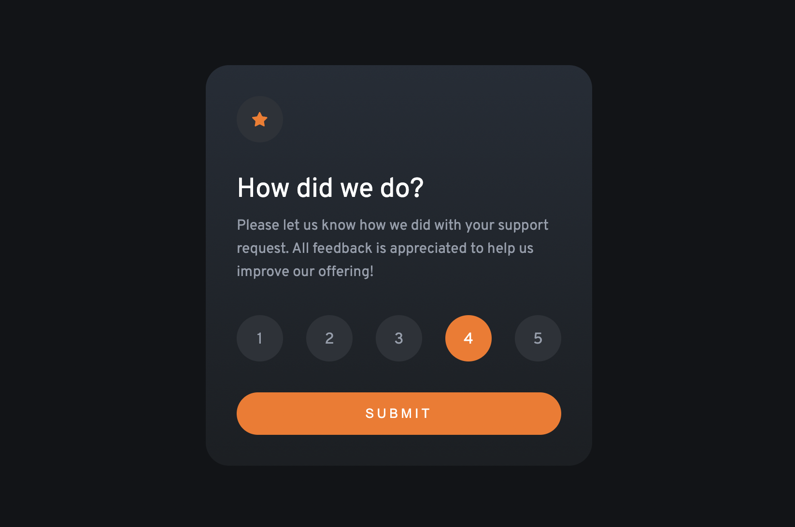

# Frontend Mentor - Interactive rating component solution

This is a solution to the [Interactive rating component challenge on Frontend Mentor](https://www.frontendmentor.io/challenges/interactive-rating-component-koxpeBUmI). Frontend Mentor challenges help you improve your coding skills by building realistic projects.

## Table of contents

- [Overview](#overview)
  - [The challenge](#the-challenge)
  - [Screenshot](#screenshot)
  - [Links](#links)
- [My process](#my-process)
  - [Built with](#built-with)
  - [What I learned](#what-i-learned)
  - [Continued development](#continued-development)
  - [Useful resources](#useful-resources)
- [Author](#author)

## Overview

### The challenge

Users should be able to:

- View the optimal layout for the app depending on their device's screen size
- See hover states for all interactive elements on the page
- Select and submit a number rating
- See the "Thank you" card state after submitting a rating

### Screenshot

### Links

- [My Frontend Mentor submision](https://www.frontendmentor.io/solutions/interactive-rating-component-jm8QeFM-3Y)
- [Live site](https://jacob-dunbar.github.io/interactive-rating-component/)

## My process

### Built with

- HTML5 
- CSS 
- Flexbox
- JavaScript

### What I learned

- This was my first project using JavaScript outside of the Codecademy built-in text editor. Learning how to use JavaScript to update the DOM was very satisfying.

- I learned about node lists and how they differ from arrays but can still be iterated over with forEach(). 

- Also learned about event propagation, and how to use the stopPropagation() method to control the events fired when the user interacts with the component.

- I decided to try and push it a little further than the challenge brief required by creating an inactive state for the submit button. This push required some problem-solving from me, as the way to achieve this wasn’t immediately obvious. Scouring the internet for solutions to problems is a skill in itself, and I certainly got some practice here.

### Continued development

 - I would like to take this project further by having the ratings be submitted to a database or recorded somehow for review. I began to read about how this would be achieved but was unable to implement it. I am hoping to gain more of an understanding of how that would be achieved in a future project. 

### Useful resources

- [A simplified explanation of event propagation in JavaScript](https://www.freecodecamp.org/news/a-simplified-explanation-of-event-propagation-in-javascript-f9de7961a06e/#:~:text=Event%20propagation%20is%20a%20way,a%20web%20browser%20are%20nested.) - This article really helped understand event propagation, and what I needed to do to make the component work as expected.
- [JavaScript HTML DOM Node Lists](https://www.w3schools.com/js/js_htmldom_nodelist.asp#:~:text=A%20NodeList%20is%20a%20collection,is%20always%20a%20live%20collection.) - W3Schools is another resource I often find myself turning to for answers. I found this explanation of node lists really helpful. 

## Author

- Frontend Mentor - [@Jacob-Dunbar](https://www.frontendmentor.io/profile/Jacob-Dunbar)

